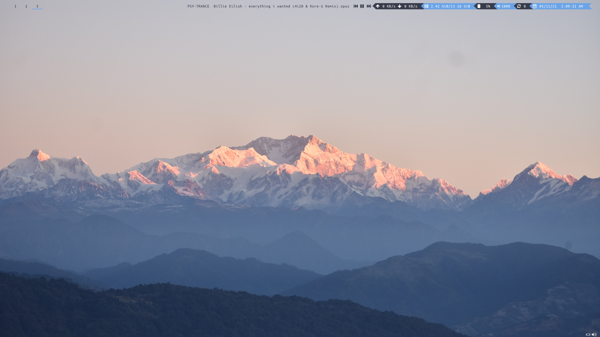
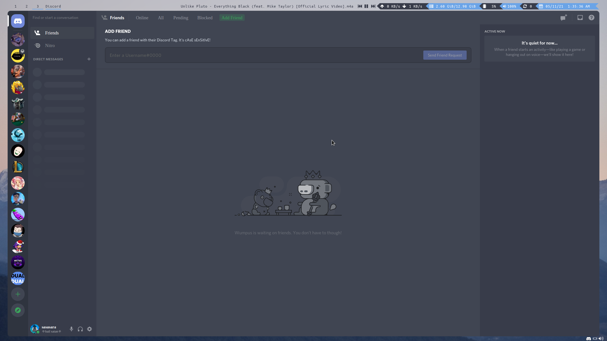
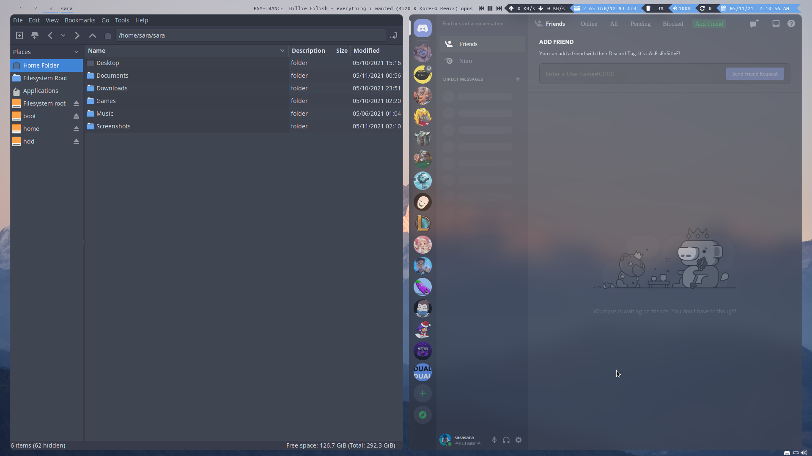
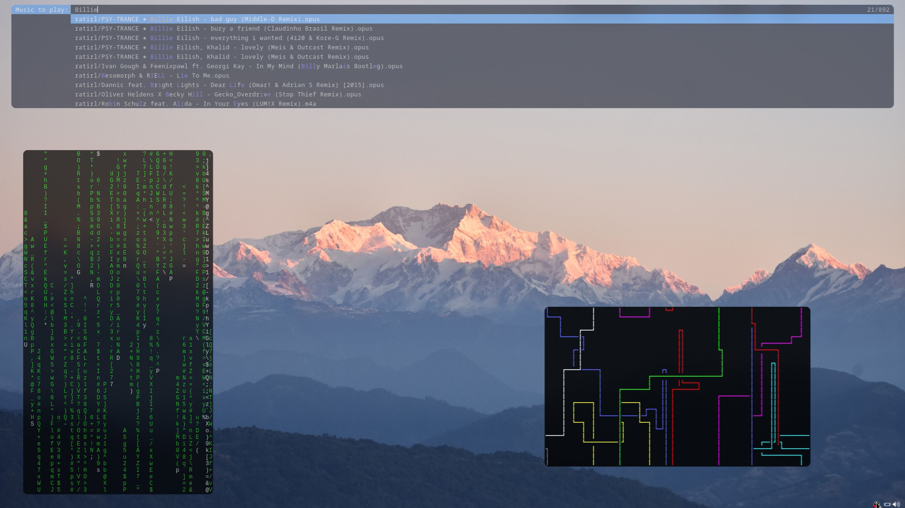
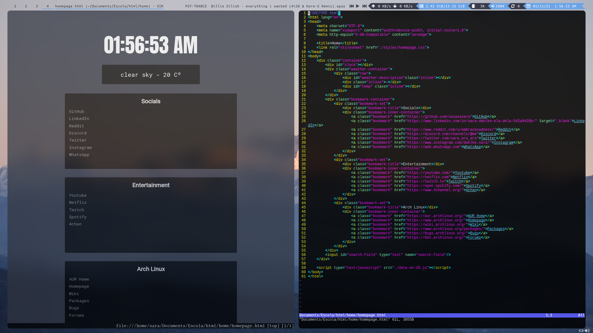
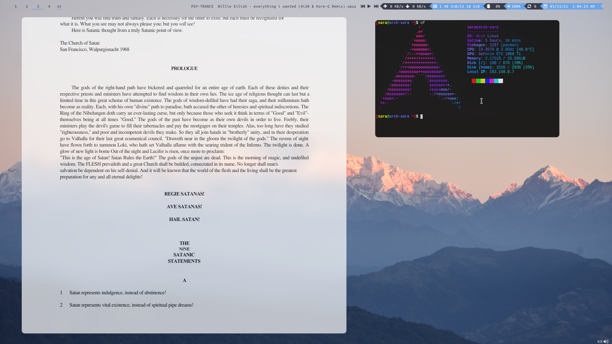

# dotfiles
My personal home computer config.
---
The current programs are:

* Alacritty
* Bash
* Discord (custom CSS)
* dmenu (custom scripts)
* Dunst
* i3-gaps
* i3status
* Neofetch
* Qtile
* Qutebrowser
* VIM
* Xbindkeys

Screenshots
===========

A clean workspace.

---

Discord CSS (injected with [BeautifulDiscord](https://github.com/leovoel/BeautifulDiscord).

Discord CSS vs PCManFM GTK.

---

dmenu dm-music script.

---

Qutebrowser vs VIM when coding web pages.

---

Reading a book with MuPDF + Neofetch by the side.
